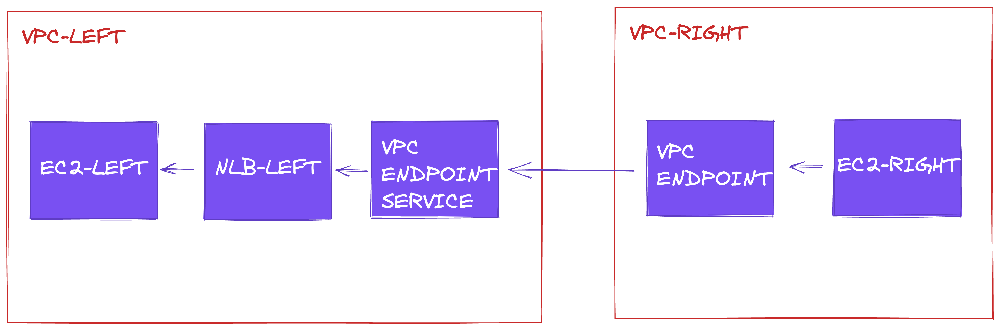

# VPC Endpoints

An experiment with VPC Endpoints to expose service A in VPC A, to the network in VPC B. Although this example uses VPCs in the same account, the approach should work inter-account as well.

Depending on your use case, this means we can skip the network design that comes with the use of Transit Gateway and VPC Peering. Of course it isn't free, coming at the cost of latency, $/hr, $/GB and bandwidth.

# Running the experiment

I had to comment out the compute resources to standup the networking components first, then uncomment afterward. But otherwise, it should be straight forward to `terraform apply`.

Once the "left" EC2 instance is stood up, connect via Session Manager in the console and run `sudo apt update && sudo apt install nginx -y`, you can test this with `curl localhost`.

Browse to VPC Endpoints in the console, grab the top DNS record (multi-az).

Connect to the "right" EC2 instance via Session Manager in the console. If you `curl $endpoint_domain`, you will get a timeout. This is expected, because we haven't accepted the connection. So browse to VPC Endpoint Services and accept the VPC Endpoint connection.

It will take some time (5-10m) while the connection is provisioning. Even after the connection had been provisioned, you may have another couple minute delay. However, given some time, you can now `curl $endpoint_domain` from the "right" EC2 instance.
